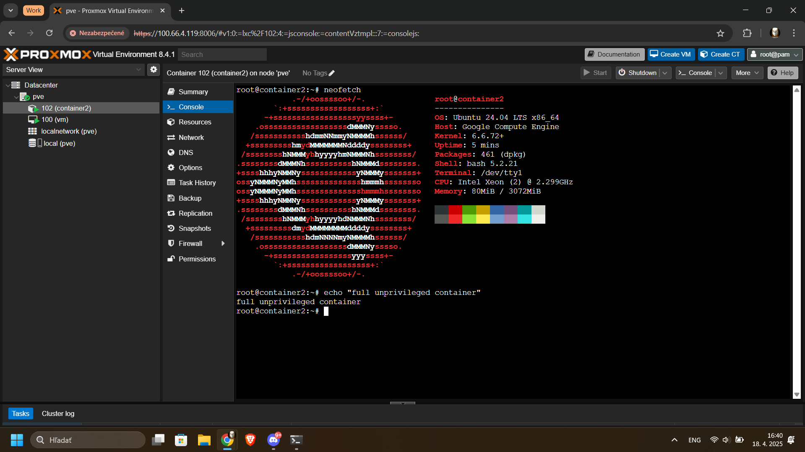
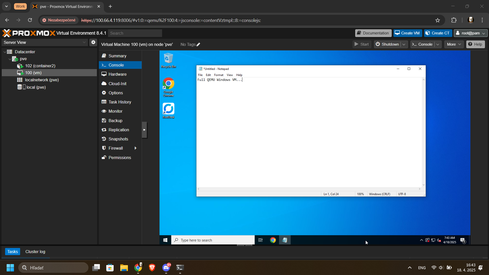
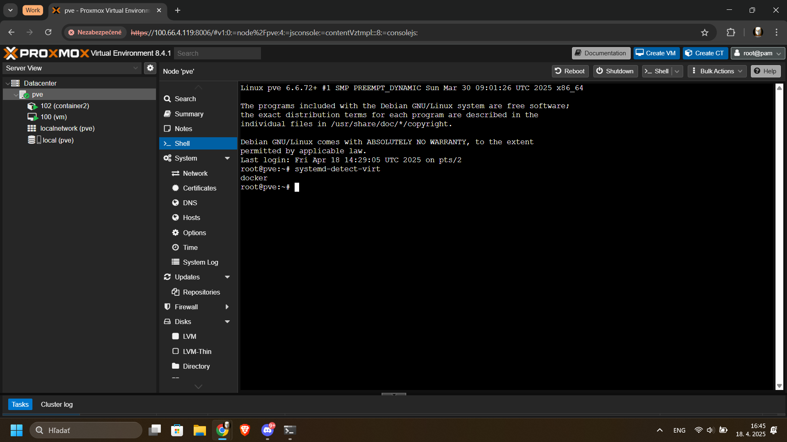

# Table of contents
- [Overview](#overview)
- [Getting Started](#getting-started)
- [Troubleshooting](#troubleshooting)

## Overview
*Dockermox* (Docker**prox**mox) is a docker based solution to run Proxmox VE in a docker container inside linux hosts. With the support of also for arm64.


There is full support for LXC containers, Click [here](./lxc/main.md) for more information.



As usual it is Docker, not a Proxmox VM.

Default username and password:

**Username**: root 

**Password**: root

## Getting Started
Before we can start, we need to verify that we can run it.

In order to verify, run the following command.

```bash
ls /dev/fuse
```

If the result is "/dev/fuse" then you can continue otherwise activate the fuse module in your kernel.


*Dockermox* can be ran by using this docker command

x86_64
```bash
docker run -itd --name proxmoxve --hostname pve -p 8006:8006 --privileged rtedpro/proxmox:9.0.11
```

arm64 (Source: PXVIRT)
```bash
docker run -itd --name proxmoxve --hostname pve -p 8006:8006 --privileged rtedpro/proxmox:8.4.1-arm64
```

**WARNNING** No vmbr0 bridge is created by default, click [here](./vmbr0/README.md) to set it up

## Troubleshooting
Please create a issue and describe the issue you have.
