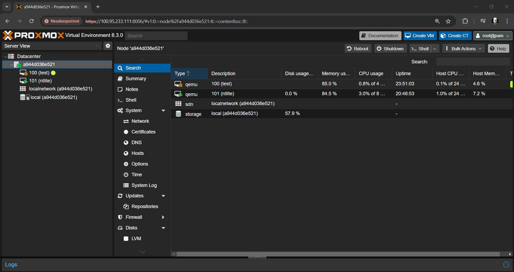
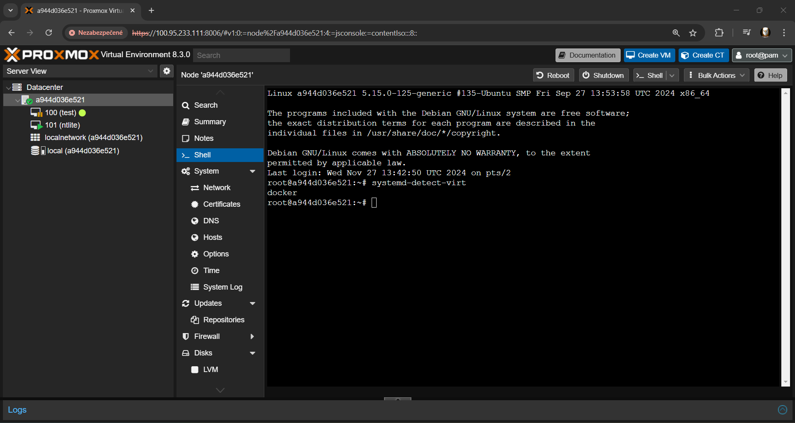

# Table of contents
- [Overview](#overview)
- [Getting Started](#getting-started)
- [Troubleshooting](#troubleshooting)

## Overview
*Dockermox* (Docker**prox**mox) is a docker based solution to run Proxmox VE in a docker container inside linux hosts. Theres no support for arm64 at the moment.



## Getting Started
*Dockermox* can be ran by using this docker command
```bash
docker run -itd --name proxmoxve --hostname pve -p 8006:8006 --privileged rtedpro/proxmox:8.3b2
```
By default theres no vmbr0 networking. Instead deploy the VM (LXC Not supported yet) without network and then apply the network patch for your VMID.
```bash
sudo qm set VMID --args "-device e1000,netdev=n0 -netdev user,id=n0"
```

## Troubleshooting
Please create a issue and describe the issue you have.
