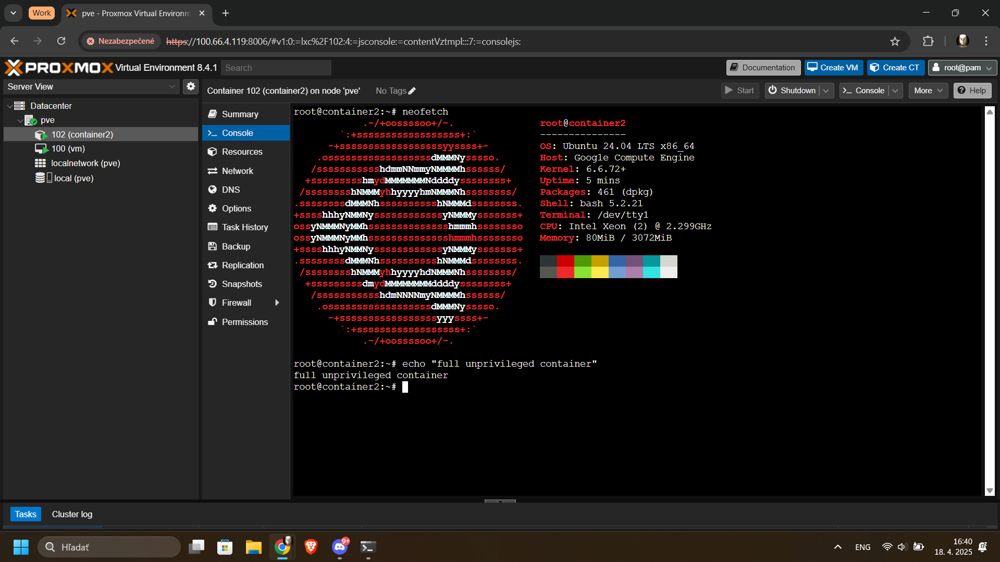
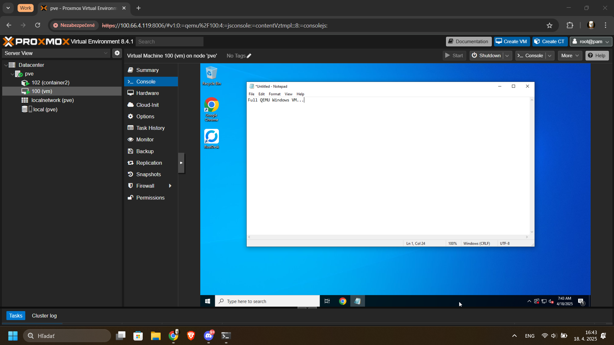
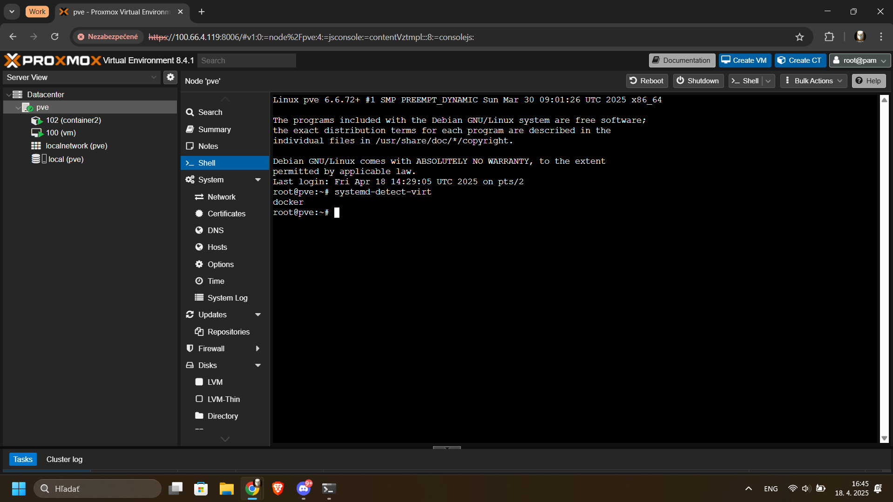

# Table of contents
- [Overview](#overview)
- [Getting Started](#getting-started)
- [Troubleshooting](#troubleshooting)

## Overview
*Dockermox* (Docker**prox**mox) is a docker based solution to run Proxmox VE in a docker container inside linux hosts. With the support of also for arm64.


> [!NOTE]
> There is full support for LXC containers, thanks to [@PowerEdgeR710](https://github.com/PowerEdgeR710), there is no need for manually modifing LXC Configs.



As usual it is Docker, not a Proxmox VM.



## Getting Started
Before we can start, we need to verify that we can run it.

In order to verify, run the following command.

```bash
ls /dev/fuse
```

If the result is `/dev/fuse` then you can continue otherwise, try modprobing the `fuse` module in your kernel.

> [!NOTE]
> Default username and password
>
>**Username**: root 
>
> Due to security, you can find the randomly generated password using the following command:
> ```
> cat ~/.dockermox/.dockpass
> ```


> [!IMPORTANT]
> *Change the generated password after running the container.*
> 
> **Password will be hashed with sha256 on the 4th startup of the container.**

*Dockermox* can be ran by using one of these `docker run` commands.

x86_64 (Slim Image, 2 GB)
```bash
docker run -itd --name proxmoxve --hostname pve -p 8006:8006 -v ~/.dockermox:/usr/lib/dockermox --privileged rtedpro/proxmox:9.2.4
```

x86_64 (Full Image, 4 GB)
```bash
docker run -itd --name proxmoxve --hostname pve -p 8006:8006 -v ~/.dockermox:/usr/lib/dockermox --privileged rtedpro/proxmox:9.2.4-full
```

arm64 (Source: [PXVIRT](https://github.com/jiangcuo/pxvirt), old image, password is: `root`)
```bash
docker run -itd --name proxmoxve --hostname pve -p 8006:8006 --privileged rtedpro/proxmox:8.4.1-arm64
```


> [!WARNING]
> No `vmbr0` bridge is created by default. Click [here](./vmbr0/README.md) to set it up.

## Troubleshooting
Please create a issue and describe the issue you have.
