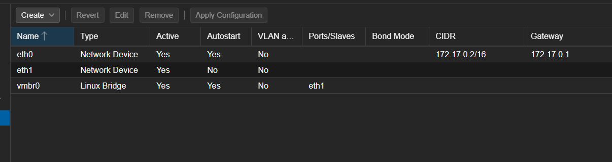

# vmbr0 in Dockermox


Start by creating a network

```bash
docker network create \
  --driver bridge \
  --subnet=192.168.2.0/24 \
  eth2
```

Assign to a container

```bash
docker network connect eth2 proxmoxve
```

Connect to the container

```bash
docker exec -it proxmoxve bash
```

When connected to container, execute this

```bash
for i in $(ip -o link show | awk -F': ' '{print $2}' | grep -v lo | sed 's/@.*//'); do echo -e "auto $i\niface $i inet manual\n" >> /etc/network/interfaces; done
```

Create a Linux Bridge and bridge it to eth1, then apply the configuration.



After applying the configuration, it may be required to restart the container manually due to a proxmox issue which didn't happen before 8.4.9 was released for dockermox.

```bash
docker restart proxmoxve
```

Thats all! Then you will have to apply static ips in VMs to have network access. (Or create your own DHCP SERVER)
